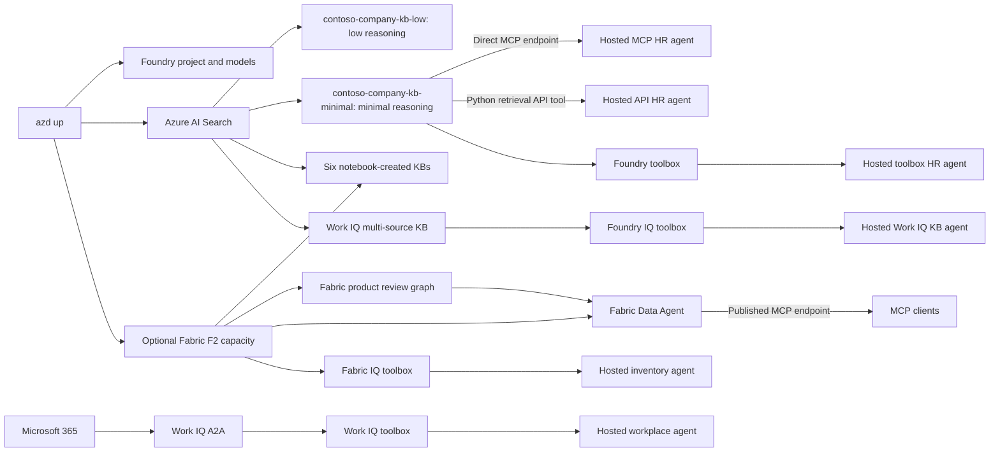

# Foundry IQ deep dive

This repository combines a six-part Microsoft Foundry IQ notebook lab with six deployable
[Microsoft Agent Framework](https://learn.microsoft.com/agent-framework/) agents. One `azd`
project provisions the shared Foundry project, `gpt-5.4` and `text-embedding-3-large` deployments,
Azure AI Search, storage, monitoring, and an optional F2 Fabric capacity. It then prepares Search
data, creates low- and minimal-reasoning HR knowledge bases, and deploys the agents directly from Python source.

## Architecture



The examples intentionally remain independent. The notebooks create learning-path knowledge bases with low
reasoning effort. Provisioning also creates `contoso-company-kb-low` with low reasoning effort and
`contoso-company-kb-minimal` with minimal reasoning effort over the same HR and health sources.
The low-reasoning KB uses the configured Azure OpenAI model for query planning; the minimal-reasoning
KB is extractive and does not configure a model.
Three hosted agents use `contoso-company-kb-minimal`: one connects through its direct Foundry IQ
MCP endpoint, one calls the `2026-05-01-preview` retrieval API from a custom Python tool, and one uses
a Foundry toolbox containing the knowledge base, web search, and code interpreter tools. The fourth
agent uses a separate toolbox connected directly to the Fabric IQ ontology used by
`foundryiq-fabriciq-ontology.ipynb`. It passes through the invoking user's Entra identity and does not use a
notebook-created knowledge base.
The Fabric Data Agent combines that ontology with a Fabric Graph Model over synthetic product reviews. The
ontology owns product, category, supplier, store, and inventory facts; the graph owns reviewers, reviews,
features, and feature-level sentiment. Product SKU is the shared key between the complementary sources.
The fifth agent uses a separate OAuth2 `RemoteA2A` connection and toolbox to query the signed-in user's
Microsoft 365 work context through Work IQ.
The sixth agent uses a Foundry toolbox connected to a provisioned multi-source Work IQ knowledge base.
The connection authenticates to Search with the project managed identity;
Toolbox supplies the signed-in user's Search token as query-source authorization so the knowledge base
can call its Work IQ knowledge source.

## Prerequisites

- An Azure subscription with permission to create resources and role assignments
- [Azure Developer CLI](https://learn.microsoft.com/azure/developer/azure-developer-cli/install-azd)
  with the `azure.ai.agents` and `azure.ai.connections` extensions available
- [uv](https://docs.astral.sh/uv/getting-started/installation/) and Python 3.12+
- Quota in one region for Foundry hosted agents, `gpt-5.4`, and `text-embedding-3-large`
- For notebook parts 3, 5, and 6, a Fabric-capable tenant and a Fabric/Power BI license (or active Fabric
  trial) assigned to the account used by `az login`; the default deployment creates an F2 capacity
- For the Fabric toolbox agent, the same Fabric license and ontology access assigned to the account
  used by `azd auth login`; its `user-entra-token` connection uses the invoking user's permissions
- For part 2, a `WEB_IQ_KEY` supplied by the Build lab organizer
- For parts 4 and 5, Microsoft-approved access to Work IQ retrieval through Azure AI Search, as
  described below
- For the Work IQ agent, a Microsoft 365 Copilot license for each caller, a tenant enabled for Work IQ,
  and a Global Administrator for the one-time Entra app registration and admin consent

## Provision and deploy

```bash
azd auth login
azd up
```

`azd up` provisions the resources, writes the generated local settings to `.env`, restores the
sample HR and health indexes, creates the low- and minimal-reasoning HR knowledge bases and Foundry toolbox,
prepares Fabric when enabled, creates the Fabric product review graph, publishes an ontology- and
Graph-backed Fabric Data Agent, creates a
separate `fabric-ontology-tools` toolbox, and deploys all six agents. The Fabric Data Agent's ID and
MCP endpoint are written to `FABRIC_DATA_AGENT_ID` and `FABRIC_DATA_AGENT_MCP_URL`. The Fabric toolbox
targets the generated ontology endpoint exactly and uses the `fabric-ontology-connection` remote-tool
connection. The Graph Model's ID and portal link are written to `FABRIC_GRAPH_ID` and
`FABRIC_GRAPH_UI_URL`.

The review graph is built from deterministic synthetic data loaded into the same lakehouse. Its sentiment,
confidence, and evidence values are fixture ground truth generated during provisioning; the sample does not
claim to extract sentiment with AI at runtime. Saving and refreshing the Graph Model ingests those tables into
Fabric's queryable graph representation.

Set `DEPLOY_FABRIC_CAPACITY=false` before `azd up` to use an existing Fabric workspace or skip the
Fabric portions. Set `FABRIC_WORKSPACE_ID`, `FABRIC_ONTOLOGY_ID`, and `FABRIC_GRAPH_ID` in `.env`
before running parts 3, 5, and 6 when you manage Fabric separately.

After Fabric setup completes, open `notebooks/query-fabric-data-agent.ipynb` to inspect the tools exposed by the
published Fabric Data Agent MCP endpoint and make a tool call. The notebook reads `FABRIC_TENANT_ID` and
`FABRIC_DATA_AGENT_MCP_URL` from `.env`.

### Enable Work IQ retrieval for Azure AI Search

Notebook parts 4 and 5 use a Work IQ knowledge source in Azure AI Search. This preview is disabled by
default and must be approved by Microsoft. An identity with Owner or Contributor on the subscription
must register the preview feature and then re-register the Search resource provider:

```bash
az feature register \
  --namespace Microsoft.Search \
  --name EnableFoundryIQWithWorkIQ \
  --subscription "<subscription-id>"
az provider register \
  --namespace Microsoft.Search \
  --subscription "<subscription-id>"
```

A Microsoft Entra administrator must also submit the
[Work IQ access request form](https://aka.ms/foundry-iq-work-iq-admin-consent-form). The subscription
role holder and Entra administrator can be different people. Wait for Microsoft to approve the request
before running the Work IQ notebooks. See
[Request access to Work IQ retrieval](https://learn.microsoft.com/azure/search/agentic-knowledge-source-how-to-work-iq#request-access-to-work-iq-retrieval)
for the current requirements.

### Enable the hosted Foundry IQ Work IQ agent

Enable the Work IQ knowledge-base and Toolbox creation hook, then rerun provisioning:

```bash
azd env set ENABLE_WORK_IQ_KB_TOOLBOX true
azd provision
azd deploy agent-toolbox-foundryiq-workiq
azd ai agent invoke agent-toolbox-foundryiq-workiq \
  --new-session --new-conversation \
  "Search my recent emails for Professional Claw Hammer and summarize requested actions. Use the knowledge base and its Work IQ source."
```

Postprovision creates `workiq-knowledge-source`, combines it with the shared HR and health index
sources in `multisource-workiq-knowledge-base`, and publishes `workiq-knowledge-tools`. The notebook
`foundryiq-workiq.ipynb` remains an independent walkthrough of the same Search configuration and is
not required to deploy the agent.

The dedicated `workiq-kb-mcp-connection` must target the same knowledge-base MCP URL used by the
Toolbox tool. Do not reuse `kb-mcp-connection`, whose target is `contoso-company-kb-minimal`. Toolbox uses the
matching Foundry IQ connection to authenticate Search with the project managed identity and emit the
signed-in user's Search-scoped token as `x-ms-query-source-authorization` for Work IQ retrieval.
Invoke this agent through its deployed endpoint: local runs do not receive the hosted platform's
`x-agent-foundry-call-id`, so Toolbox cannot resolve the signed-in caller for Work IQ retrieval.

### Enable the hosted Work IQ toolbox agent

Work IQ setup is opt-in because its first run requires a Global Administrator and creates a tenant app
registration. Authenticate azd as that administrator, enable Work IQ, and rerun provisioning:

```bash
az ad sp create --id fdcc1f02-fc51-4226-8753-f668596af7f7
azd env set ENABLE_WORK_IQ true
azd provision
```

The postprovision helper creates or reuses the Work IQ service principal, creates a single-tenant Entra
application with delegated `WorkIQAgent.Ask`, grants admin consent, creates the OAuth2 `RemoteA2A`
connection, adds Foundry's returned callback URI to the application, and publishes `work-iq-tools`.
The generated client secret is sent directly to the connection and is not written to `.env`.

Admin consent allows the application to request `WorkIQAgent.Ask`; it does not authorize individual
users. On a caller's first Work IQ request, the agent returns an `oauth_consent_request` containing a
short-lived sign-in link. That user opens the link once and then retries the request. Each caller must
complete this delegated OAuth authorization with their own Microsoft 365 identity.

### Seed sample mailbox data

To test Work IQ with predictable content, sign in to Outlook as the test user and send the following
three fixture messages to that same user's email address:

- [Urgent: Professional Claw Hammer out of stock at Seattle store](data/workiq-fixtures/urgent-professional-claw-hammer-out-of-stock.txt)
- [RE: Weekly inventory report - Seattle flagged](data/workiq-fixtures/weekly-inventory-report-seattle-flagged.txt)
- [Customer escalation - hammer unavailable again](data/workiq-fixtures/customer-escalation-hammer-unavailable.txt)

Use the subject and body from each fixture. Because Outlook cannot impersonate the named colleague,
prepend `Forwarded message from <name>, <role>` to the body rather than attempting to change the
sender. Verify that all three messages appear in the test user's Inbox, then try:

```text
Check my recent emails for messages about the Professional Claw Hammer. Summarize what colleagues
are saying and what actions have been requested.
```

Automated seeding through Microsoft Graph requires a dedicated Entra application with the
admin-consented `Mail.Send` application permission. That broad permission is not granted by this
project, so manual seeding is the recommended setup for a self-deployed test environment.

## Run the notebooks

Install the notebook kernel into the root environment:

```bash
uv sync --locked --all-groups
uv pip install --python .venv/bin/python -r notebooks/requirements.txt
```

Add the externally supplied `WEB_IQ_KEY` to `.env` for part 2. Then open `notebooks/` in VS Code,
select `.venv/bin/python`, and run these in order:

1. `foundryiq-basic.ipynb`
2. `foundryiq-webiq.ipynb`
3. `foundryiq-fabriciq-ontology.ipynb`
4. `foundryiq-workiq.ipynb`
5. `foundryiq-fabriciq-dataagent.ipynb`

Part 6 combines the HR and health indexes with the published Fabric Data Agent in a multi-source
knowledge base. It uses the signed-in user's delegated identity to query the protected Fabric source.

## Run and invoke the HR agents

Start either hosted-agent source locally:

```bash
azd ai agent run agent-foundryiq-mcp
azd ai agent invoke --local "What benefits are available, and when do I need to enroll?"

azd ai agent run agent-foundryiq-api
azd ai agent invoke --local "What benefits are available, and when do I need to enroll?"

azd ai agent run agent-toolbox-foundryiq
azd ai agent invoke --local "What benefits are available, and when do I need to enroll?"

azd ai agent run agent-toolbox-fabriciq
azd ai agent invoke --local "Which product categories have the lowest stock levels right now?"

azd ai agent run agent-toolbox-workiq
azd ai agent invoke --local \
  "Check my recent Teams chats for messages about the Professional Claw Hammer. Summarize what colleagues are saying and what actions have been requested."
```

Redeploy an individual agent after code changes and invoke the deployed version:

```bash
azd deploy agent-foundryiq-mcp
azd ai agent invoke agent-foundryiq-mcp "What benefits are available, and when do I need to enroll?"

azd deploy agent-foundryiq-api
azd ai agent invoke agent-foundryiq-api "What benefits are available, and when do I need to enroll?"

azd deploy agent-toolbox-foundryiq
azd ai agent invoke agent-toolbox-foundryiq "What benefits are available, and when do I need to enroll?"

azd deploy agent-toolbox-foundryiq-workiq
azd ai agent invoke agent-toolbox-foundryiq-workiq \
  --new-session --new-conversation \
  "Search my recent emails for Professional Claw Hammer and summarize requested actions. Use the knowledge base and its Work IQ source."

azd deploy agent-toolbox-fabriciq
azd ai agent invoke agent-toolbox-fabriciq \
  --new-session --new-conversation \
  "Which product categories have the lowest stock levels right now?"

azd deploy agent-toolbox-workiq
azd ai agent invoke agent-toolbox-workiq \
  --new-session --new-conversation \
  "Check my recent Teams chats for messages about the Professional Claw Hammer. Summarize what colleagues are saying and what actions have been requested."
```

Direct source deployment is used because the final agent requires no custom OS packages. Foundry's
remote build resolves each agent folder's `pyproject.toml` and `uv.lock`, avoiding an unnecessary
container registry and image-build path.

## Validate locally

```bash
uv sync --locked --all-groups
uv run ruff check .
uv run python -m compileall -q infra src/agent-foundryiq-mcp src/agent-foundryiq-api src/agent-toolbox-foundryiq src/agent-toolbox-foundryiq-workiq src/agent-toolbox-fabriciq src/agent-toolbox-workiq
uv run python scripts/check_repo.py
az bicep build --file infra/main.bicep --stdout > /dev/null
azd show
```

## Resources

- [Mastering Foundry Toolbox](https://github.com/microsoft-foundry/forgebook/blob/main/notebooks/mastering-foundry-toolbox.ipynb)

See [ATTRIBUTION.md](ATTRIBUTION.md) for the exact upstream revisions and retained licenses.
